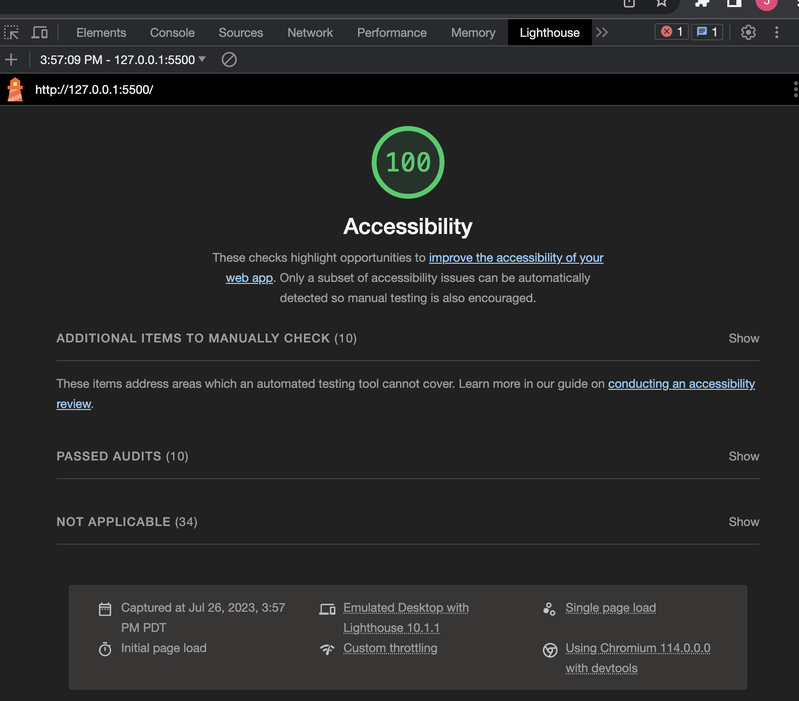

# odd-duck
A survey created to track images selected by user and display data in the form of a chart using Chart.js. Also includes save state functionality using localstorage API.

## Lighthouse Score
